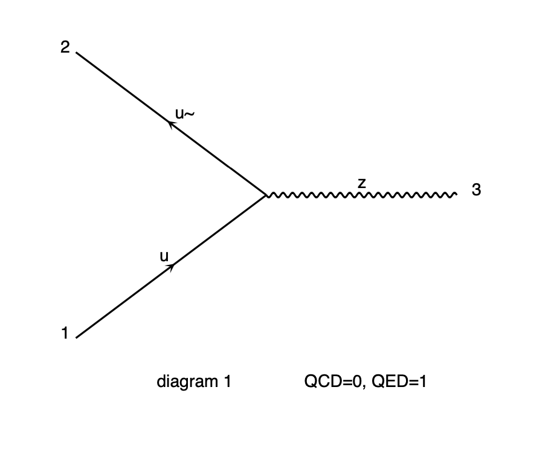

# 3. first test

[**chapter two**](02_mg.md)

## 3.1 process description

MG is an automatic code generator,
hence it's necessary to instruct the program
about the process to be generated

### 3.1.1 elementary particles

Each elementary particle has a name in Madgraph language

| particle    | symbol  | particle    | symbol  |
| ----------- | ------- | ----------- | ------- |
| electron    | e-      | positron    | e+      |
| neutrino-e  | ve      | anti-ve     | ve~     |
| muon        | mu-     | anti-muon   | mu+     |
| neutrino-mu | vm      | anti-vm     | vm~     |
| tau         | ta-     | antitau     | ta+     |
| neutrino-ta | vt      | anti-vt     | vt~     |
| quark u     | u       | anti-u      | u~      |
| quark d     | d       | anti-d      | d~      |
| quark c     | c       | anti-c      | c~      |
| quark s     | s       | anti-s      | s~      |
| quark t     | t       | anti-t      | t~      |
| quark b     | b       | anti-b      | b~      |
| photon      | a       | gluon       | g       |
| W- boson    | w-      | W+ boson    | w+      |
| Z boson     | z       | higgs boson | h       |

* more particles defined in the [naming scheme](http://madgraph.phys.ucl.ac.be/sm_particles.html)
* one can define new particles:
```
define j = g u c d s u~ c~ d~ s~
define l+ = e+ mu+
define l- = e- mu-
define vl = ve vm vt
define vl~ = ve~ vm~ vt~
```
* some of them are already present in MG:
```
define p = g u c d s u~ c~ d~ s~
```

### 3.1.2 the description of an elementary process

From the initial state to the final state, at LO

  * Z boson at proton colliders:
    * initial state: ```p p```
    * final state: ```z```
  ```
  p p > z
  ```
  * electron-positron pairs at proton colliders:
    * initial state: ```p p```
    * final state: ```e+ e-```
  ```
  p p > e+ e-
  ```

The second process is **not equivalent to the first one**:
  * the Z boson is not decayed in the first case
  * the second process contains all possible diagrams at LO
    that can produce a ```e+ e-``` pair starting from protons,
    while the second one has to generate a Z boson

  * W boson pairs with opposite charge at proton colliders:
    * initial state: ```p p```
    * final state: ```w+ w-```
  ```
  p p > w+ w-
  ```
  * charged and neutral lepton pairs at proton colliders:
    * initial state: ```p p```
    * final state: ```e- ve~ mu+ vm```
  ```
  p p > e- ve~ mu+ vm
  ```

## 3.2 fist test of MG

### 3.2.1 start an interative session

Start the interative session from the MG folder:
```
cd MG5_aMC_v2_7_2/
./bin/mg5_aMC
```
At startup, MG:
  * tries to load LHAPDF and FastJet;
    in this case it fails, since they have not been installed
  * loads the physics model to be used in the simulation:
  ```
  Loading default model: sm
  INFO: load particles
  INFO: load vertices
  INFO: Restrict model sm with file models/sm/restrict_default.dat .
  INFO: Run "set stdout_level DEBUG" before import for more information.
  INFO: Change particles name to pass to MG5 convention
  ```
  * defines some collections of particles:
  ```
  Defined multiparticle p = g u c d s u~ c~ d~ s~
  Defined multiparticle j = g u c d s u~ c~ d~ s~
  Defined multiparticle l+ = e+ mu+
  Defined multiparticle l- = e- mu-
  Defined multiparticle vl = ve vm vt
  Defined multiparticle vl~ = ve~ vm~ vt~
  Defined multiparticle all = g u c d s u~ c~ d~ s~ a ve vm vt e- mu- ve~ vm~ vt~ e+ mu+ t b t~ b~ z w+ h w- ta- ta+
  ```
    * why is the proton constituted of anti-quarks and gluons as well?
    * how does one instruct MG about colliding protons or anti-protons?
    * why are charged leptons defined grouping only electrons and muons?

### 3.2.2 generating a process

  * Z boson production at proton colliders, at LO:
  ```
  MG5_aMC> generate p p > z
  ```
  * MG output:
    the program identified 4 processes with 4 diagrams:
  ```
  INFO: Checking for minimal orders which gives processes.
  INFO: Please specify coupling orders to bypass this step.
  INFO: Trying process: g g > z WEIGHTED<=2 @1  
  INFO: Trying process: u u~ > z WEIGHTED<=2 @1  
  INFO: Process has 1 diagrams
  INFO: Trying process: u c~ > z WEIGHTED<=2 @1  
  INFO: Trying process: c u~ > z WEIGHTED<=2 @1  
  INFO: Trying process: c c~ > z WEIGHTED<=2 @1  
  INFO: Process has 1 diagrams
  INFO: Trying process: d d~ > z WEIGHTED<=2 @1  
  INFO: Process has 1 diagrams
  INFO: Trying process: d s~ > z WEIGHTED<=2 @1  
  INFO: Trying process: s d~ > z WEIGHTED<=2 @1  
  INFO: Trying process: s s~ > z WEIGHTED<=2 @1  
  INFO: Process has 1 diagrams
  INFO: Process u~ u > z added to mirror process u u~ > z
  INFO: Process c~ c > z added to mirror process c c~ > z
  INFO: Process d~ d > z added to mirror process d d~ > z
  INFO: Process s~ s > z added to mirror process s s~ > z
  4 processes with 4 diagrams generated in 0.045 s
  Total: 4 processes with 4 diagrams
  ```

### 3.2.3 check of the generated process

  * list of the sub-processes identified:
    MG produces the list of elementary processes
    that can originate the final state required:
  ```
  MG5_aMC> display processes
  Process: u u~ > z WEIGHTED<=2 @1
  Process: c c~ > z WEIGHTED<=2 @1
  Process: d d~ > z WEIGHTED<=2 @1
  Process: s s~ > z WEIGHTED<=2 @1
  ```
    * the more complex is the final state, the more are the sub-processes
  * drawing the generated diagrams
  ```
  MG5_aMC> display diagrams
  ```
  * MG draws this for each process:
  
    * tree level of the interaction for each diagram
      participating in the process
    * vertices order: ```QCD=0``` means that there are no QCD vertices
      ,```QED=1``` means that there is one electroweak vertex
    * this diagram corresponds to the process ```u u~ > z```

### 3.3 saving of what done so far

  * MG allows to save what it has done in a folder:
  ```
  MG5_aMC> output test_Z
  ```
  * the name ```test_Z``` is chosen by the user
  * to exit:
  ```
  MG5_aMC> quit
  ```

### 3.4 exercises

  * generate the diagrams of the process: ```p p > e+ e-```
    and compare them to the ones of the process```p p > z```:
    * what are the differences?
    * did you expect them?
  * generate the diagrams of the processes : ```p p > w+ w-```
    and ```p p > e+ ve e- ve~```:
    * what are the differences?
    * did you expect them?
  * generate the diagrams of the process: ```p p > t t~```:
    * what's new with respect to the previuos ones?


[**chapter four**](04_cfg.md)
