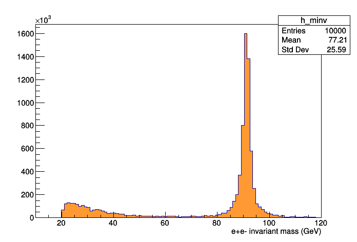

# 8. filling a histogram

[**chapter seven**](07_read.md)

The event content can be used to fill an histogram that summarises
what has been generated.
This exercise is built adding the necessary pieces of information
to the file of the previous exercise.

## 8.1 preparing the histogram to be filled

  * in the ```#include``` statements of the new program,
	  the libraries for the histogram and for the canvas where to plot
		the results are included.
```c
#include "TH1F.h"
#include "TCanvas.h"
```		
  * before the start of the event loop, a histogram object of type ```TH1F```
	  is prepared
```c
TH1F h_minv ("h_minv", "", 100, 10., 120.) ;
```		

## 8.2 filling the histogram

  * during the event loop, the weight associated to each event
	  is read and assigned to a variable:
```c
float eventWeight = reader.hepeup.XWGTUP ;
```		
  * if there are not two charged leptons in the event
	  (this case would let the program crash),
		the event is skipped:
```c
// check that there's exactly two charged leptons
if (v_f_leptons.size () != 2) continue ;
```		
  * the invariant mass of the charged lepton pair
	  is calculated as the one of the four-vector
		resulting from the sum of the charged leptons' ones:
```c
XYZTVector resonance = v_f_leptons.at (0) + v_f_leptons.at (1) ;
```		
  * ... and the histogram is filled with that value,
	  and with a weight for each event
		according to what is contained in the LHE file:
```c
h_minv.Fill (resonance.M (), eventWeight) ;
```		

## 8.3 drawing the histogram

To draw the histogram,
a title is given to the *x* axis,
a nice colour is chosen to fill it,
a ```TCanvas``` where the plot will be shown is prepared,
the histogram is drawn
and the canvas saved as an image:
```c
h_minv.GetXaxis ()->SetTitle ("e+e- invariant mass (GeV)") ;
h_minv.SetFillColor (kOrange + 1) ;
TCanvas c1 ;
h_minv.Draw ("hist") ;
c1.Print ("minv.png", "png") ;
```		
The resulting figure is the following:


An example of the code can be found [here](./readLHE/fillHistos.cpp)

## 8.4 questions and exercises

  * how are the single event weights and the total cross-section correlated?
	* how can one keep track of the efficiencies of the selections
	  introduced in the event loop?
		* try to apply a selection (on the invariant mass of the charged leptons,
			or on the transverse momentum p_T of the charged leptons),
			and determine the efficiency of the selections
  * how should one normalise the final histogram, taking into account
	  also the event selection efficiency?
  * if the objective is that the histogram contains the number of expected
	  events given an integrated luminosity (for example 100/fb),
		how should it be normalised,  		
		taking into account also the event selection efficiency
  * add the distribution of the transverse momentum p_T of the charged leptons
	* in what directions the charged leptons are back-to-back?
	  Show it with histograms.
  * why isn't the invariant mass plot filled down to zero?

[**chapter nine**](09_inter.md)
