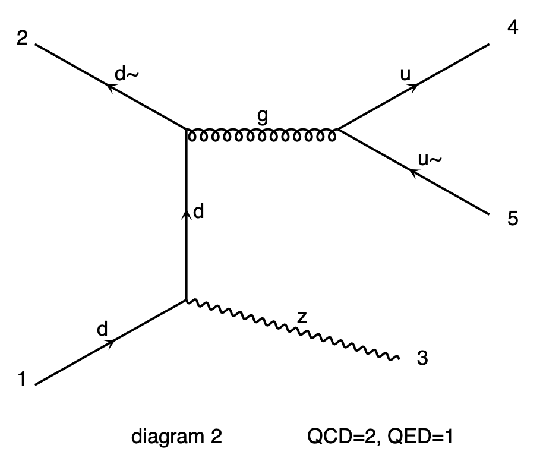
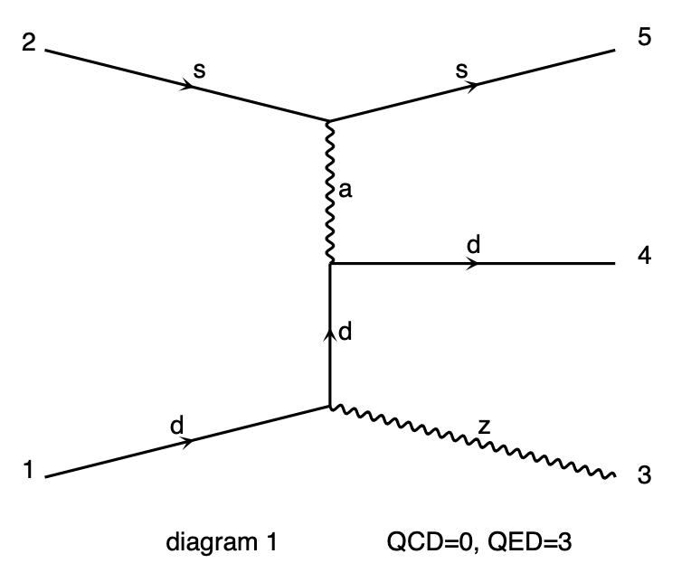

# 10. specify the allowed processes in the event generation

[**chapter nine**](09_inter.md)

## 10.1 an example to start with: Z boson plus two partons

  * MG may be used to produce processes *with also partons (quarks or gluons) in the final state*
  * One example of such a generation is a Z boson accompanied by two partons
    (where the definition of j can be found in [chapter 3](03_firstRun.md)):
```
generate p p > z j j
output zjj_default
```

### 10.1.1 the anatomy of the process

  * The outcome of the process generation will contain diagrams
    featuring *strong and the electroweak coupling vertices*, 
    indicated as ```QCD``` and ```QED``` respectively in the MG drawings
  * To find the images of the calculated diagrams:  
```
cd zjj_default/
find . -name "*.ps"
```
  * MG will generate the processes with the *minimal number of QED vertices needed*. 
    In the following example diagram, there are:
      * one QED vertex for the production of the Z boson
      * two QCD vertices for the production of the two final state quarks



## 10.2 the electro-weak production of a Z boson with two partons

  * The same process may be produced with a *purely electroweak process*:
    
  * This may be obtained by forcing the number of QCD vertices in the process:
```
generate p p > z j j QCD=0
output zjj_ewk
```
  * _nota bene_ the request ```QCD=N``` allows for up to N QCD vertices in the event 
    (the same holds for the ```QED``` vertices)
  * _nota bene_ the request ```QED==k``` allows for exactly k QED vertices in the event 
    (the same holds for the ```QCD``` vertices)

## 10.3 exercises

  * what is the value of the cross section in the two cases considered?
  * what does it happen if both the ```QED``` and ```QCD``` numbers are fixed?
  * repeat the same exercise for the generation of pair of top quarks at the LHC


[**chapter eleven**](11_decayChains.md)

